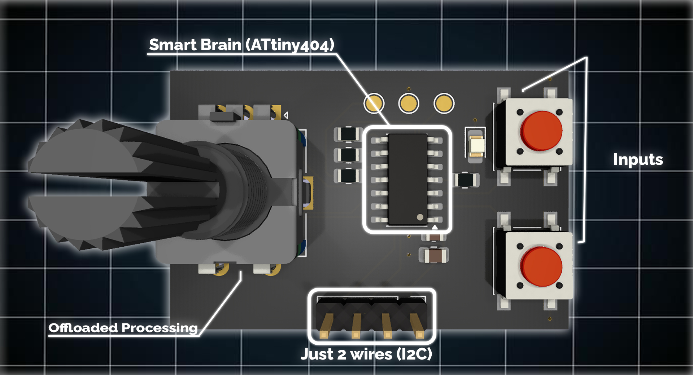

# ButtonHub

  

**Stop wasting GPIO pins.** ButtonHub is a smart, offloaded input module designed to handle rotary encoders and buttons over a simple I2C connection.

<p align="center">
  
</p>

## 🏔️ Overview

Crafted with the **Carpathian engineering spirit**, ButtonHub is designed to be clean, efficient, and immediately useful. Instead of using 3 pins for an encoder and 2 more for buttons (total 5 GPIOs), ButtonHub does all the heavy lifting internally using a dedicated **ATtiny404** processor running at 20MHz.

It delivers clean, debounced data to your main microcontroller using just **2 wires** (SDA/SCL).

### Key Features
* **Minimal Wiring:** Only requires VCC, GND, SDA, and SCL.
* **Smart Processing:** Internal hardware debounce and state management.
* **Versatile Inputs:** Handles 1 Rotary Encoder (with push button) + 2 External Buttons.
* **Configurable:** Change I2C address and encoder limits via software.
* **High Performance:** Powered by ATtiny404 @ 20MHz for zero latency.
* **Arduino Ready:** Comes with an easy-to-use library.

---

## 🚀 Getting Started

### Hardware Connection
Connect the ButtonHub to your microcontroller's I2C pins.

| ButtonHub Pin | Arduino/ESP32 | Description |
| :--- | :--- | :--- |
| **VCC** | 3.3V / 5V | Power Supply |
| **GND** | GND | Ground |
| **SDA** | SDA | I2C Data |
| **SCL** | SCL | I2C Clock |

### Default Settings
* **I2C Address:** `0x10` (Decimal: 16)
* **Encoder Limit:** `0 - 100` (Default)

---

## 💻 Arduino Library Usage

### Installation
1.  Download this repository as a ZIP file.
2.  Open Arduino IDE -> Sketch -> Include Library -> Add .ZIP Library.
3.  Select the downloaded file.

### Basic Example
Here is a simple sketch to read the encoder value and button states.

```cpp
#include <Wire.h>
#include "ButtonHub.h"

// Initialize ButtonHub with default address 0x10
ButtonHub hub(0x10);

void setup() {
  Serial.begin(115200);
  
  // Start the I2C connection
  if (!hub.begin()) {
    Serial.println("ButtonHub not found. Check wiring!");
    while (1);
  }
  
  Serial.println("ButtonHub Connected!");
  
  // Optional: Change the encoder limit (e.g., for a servo 0-180)
  // hub.setLimit(180);
}

void loop() {
  // You must call update() to fetch new data from the module
  if (hub.update()) {
    
    // Print Encoder Value
    Serial.print("Encoder: ");
    Serial.print(hub.getEncoderValue());
    
    // Check Buttons
    if (hub.isEncoderPressed()) {
      Serial.print(" | Enc Button: PRESSED");
    }
    
    if (hub.isButton1Pressed()) {
      Serial.print(" | Btn 1: PRESSED");
    }
    
    if (hub.isButton2Pressed()) {
      Serial.print(" | Btn 2: PRESSED");
    }
    
    Serial.println();
  }
  
  delay(50); // Small delay to keep serial readable
}
```

---

## 📚 API Reference

### Initialization

| Method | Description |
| :--- | :--- |
| **`ButtonHub(uint8_t addr)`** | Constructor. Default address is `0x10`. | 
| **`bool begin()`** | Initializes the I2C bus. Returns `true` if connected. |
| **`bool isConnecter()`** | Pings the module to check connection. |

### Data Retrieval

These methods return the state **captured during the last `update()` call**.

| Method | Returns | Description |
| :--- | :---: | :--- |
| **`bool update()`** | `true`/`false` | **Critical**: Fetches new data from the module. Call this in `loop()` |
| **`int16_t getEncoderValue()`** | `int` | Returns current encoder position (0 to limit. Limit max: 255) |
| **`bool isEncoderPressed()`** | `bool` | Returns `true` if the rotary encoder button is pressed. |
| **`bool isButton1Pressed()`** | `bool` | Returns `true` if external button 1 is pressed. |
| **`bool isButton2Pressed()`** | `bool` | Returns `true` if external button 2 is pressed. |

### Configuration

| Method | Description |
| :--- | :--- |
| **`void setLimit(uint8_t limit)`** | Sets the maximum value for the encoder (e.g., 255 for PWM). | 
| **`void setI2CAddress(uint8_t newAddr)`** | Changes the I2C address of the module permanently (saved in EEPROM). |

---

## ⚙️ Technical Details (Raw I2C Protocol)

If you are using **Python (Raspberry Pi)** or another platform without the Arduino library, you can communicate directly via I2C.

### Reading Data

Request **3 bytes** from the device address.

| Byte index | Data type | Description |
| :---: | :---: | :--- |
| **0** | `uint8_t` | **Button Register**. Bitmask for button states.<br>`Bit 0`: Encoder Button (Press)<br>`Bit 1`: External Button 1<br>`Bit 2`: External Button 2 |
| **1** | `uint8_t` | **Encoder Low Byte** |
| **2** | `uint8_t` | **Encoder High Byte** |

### Writing Commands

To configure the device, write 2 bytes: `[Command ID] [Value]`

| Command ID | Hex | Description |
| :--- | :---: | :--- |
| **Set Address** | `0xFA` | Follow with the new address (1 - 127). Example: `[0xFA, 0x20]` sets address to 0x20. |
| **Set limit** | `0xFB` | Follow with new limit (1-255). Example: `[0xFB, 180]`. |


<p align="center"> Designed by <strong>Carpathian Boards</strong> in Romania 🇷🇴

<em>Clean. Efficient. Ready to use.</em> </p>
